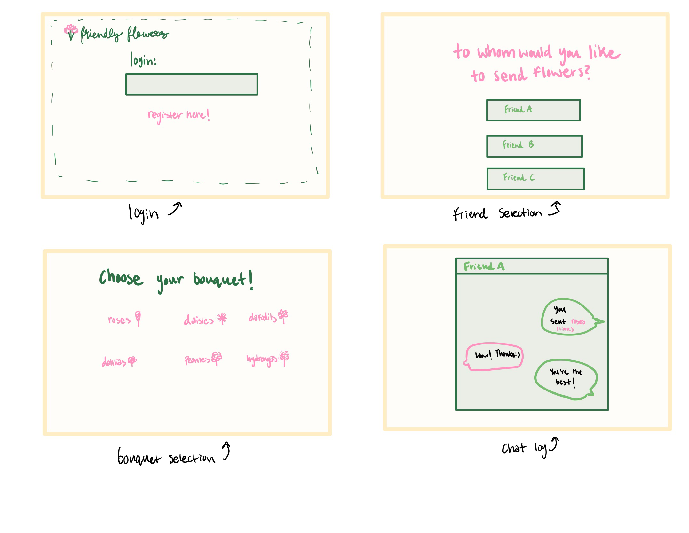

# Startup: Friendly Flowers
Startup spec for CS 260

### Elevator Pitch
Whether you are in a loving relationship or hopelessly single, Friendly Flowers is the application for you. With it, you can easily send your friends, loved ones, or potential loved ones a “hand picked” image of a bouquet of flowers. Forgot an anniversary? No problem! Send your significant other a digital floral arrangement (with an optional heartfelt message) instantly! Missing your best friend? Roses fresh from the web are coming right their way. They say romance is dead, but Friendly Flowers is here to reignite that flame.

### Design

### Key Features

- Secure registration, login, and logout
- Ability to select who to send flowers to
- Display of pre-designed hand drawn flower bouquets to choose from (text with links to images)
- Ability to select and change which bouquet to send
- Ability to send a link to the image of the bouquet, with an optional message
- Receiver may send a message back upon receiving the flowers

### Technologies
I will use the required technologies in the following ways:

- **HTML** - Using the correct HTML structure for the application. Has 4 different views, for the login page, friend selection, bouquet selection, and one for the messaging.
- **CSS** - Visually appealing color scheme, good, responsive design, and good utilization of whitespace.
- **React** - Displays the application, switching between the views, display of chat log, and general use of React for routing and components.
- **Service** - Endpoints for authentication/login, stores/retrieves messages.
- **DB/Login** - Stores the users and message logs. Used to register and login users.
- **WebSocket** - Responsible for broadcasting the messages between users.

# AWS Deliverable

For this deliverable, I deployed my server and made it accesible with the following domain name: [My server link](https://startup.friendlyflowers.click).

# HTML Deliverable

For this deliverable, I did the following:

- **HTML pages** I created 4 unique HTML pages for each of the views of my webpage
- **HTML usage** I made proper use of HTML elements including header, footer, main, nav, img, a, input, button, and more.
- **Links** I included links between each page and their views
- **Text** I included text on my pages
- **3rd Party Placeholder** The bouquet.html page has a place holder for a third party call to generate a joke
- **Images** I have images displayed on the bouquet.html page
- **Login placeholder** The main page has a login placeholder
- **DB Placeholder**The chat page has a placeholder for where chat logs will be stored
- **WebSocket Placeholder** The chat page also has a placeholder for where real time messages can be sent

